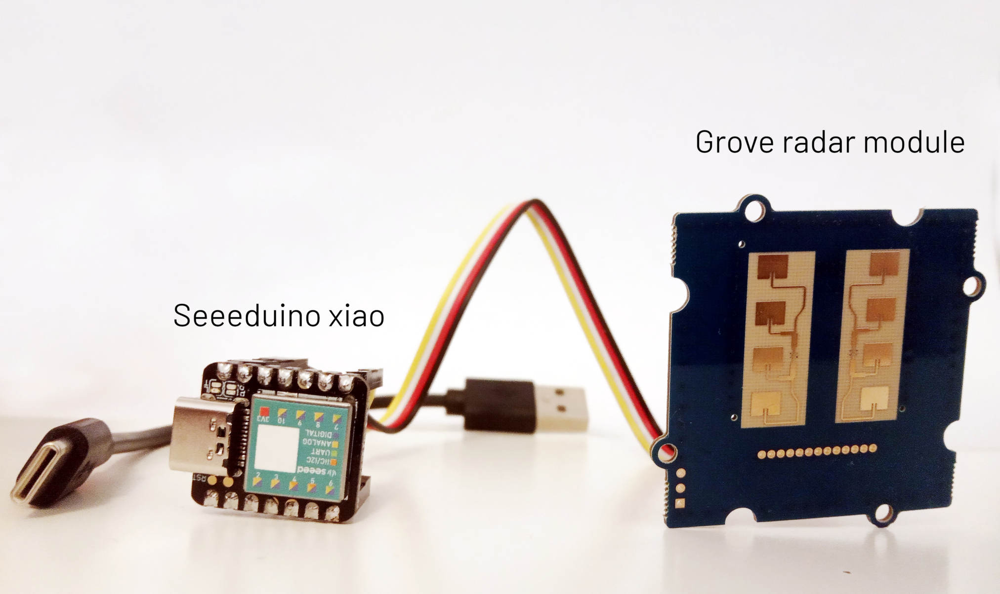

.. Grove radar documentation master file, created by
   sphinx-quickstart on Sun May  9 15:34:33 2021.
   You can adapt this file completely to your liking, but it should at least
   contain the root `toctree` directive.

Grove Doppler radar
=====================
Python version of the library for communication with the Grove Doppler Radar is based on the BGT24LTR11. It's a simple continuous wave doppler radar capable of movement detection, speed measurement and direction of movement detection. More details and resources can be found in the official product wiki available here: https://wiki.seeedstudio.com/Grove-Doppler-Radar

Quickstart
----------

Install
~~~~~~~
Run from the directory containing *setup.py* file.

.. code-block:: bash

   pip3 install .

Run a sample script
~~~~~~~~~~~~~~~~~~~
See the :doc:`page about communication <./communication>` for the details on establishing serial connection.

.. code-block:: python

   import serial

   from BGT24LTR11.BGT24LTR11 import Radar

   serial_ =\
      serial.Serial('/dev/ttyACM0', baudrate=115200, timeout=2)

   radar = Radar(serial_)
   radar.set_mode_target()

   target_info = radar.get_target_info()
   if target_info['state'] != 0:
       print(f"Speed of the detected target is {target_info['speed']} m/s")

Contents
--------
.. toctree::
   :maxdepth: 1

   communication
   methods
   links

